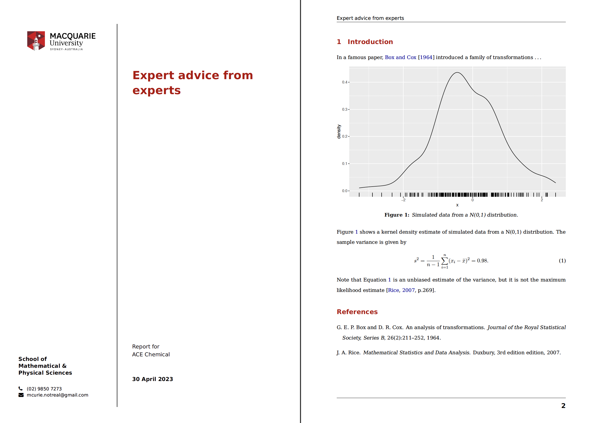

<!-- README.md is generated from README.qmd. Please edit the qmd file only -->

# Macquarie University (Research/Consulting) Report Template 

> Template for creating a new research report for Quarto.
>
> See information about how-to use this repo template inside the
> template file.

This is a Quarto template that assists you in creating a
consulting/research report for use with Macquarie University branding.
You can learn more about about Quarto using the official guide
<https://quarto.org/docs/guide/>.

This work is modified from the template of Rob J Hyndman @robjhyndman
for Monash University.

## Creating a new report

You can use this as a template to create a report. To do this, use the
following command:

``` bash
quarto use template thomas-fung/mq-research-report-quarto
```

This will install the extension and create an example qmd file that you
can use as a starting place for your report.

## Installation for existing document

You may also use this format with an existing Quarto project or
document. From the quarto project or document directory, run the
following command to install this format:

``` bash
quarto install extension thomas-fung/mq-research-report-quarto
```

## Example

<div>

[](examples/template.pdf)

</div>
